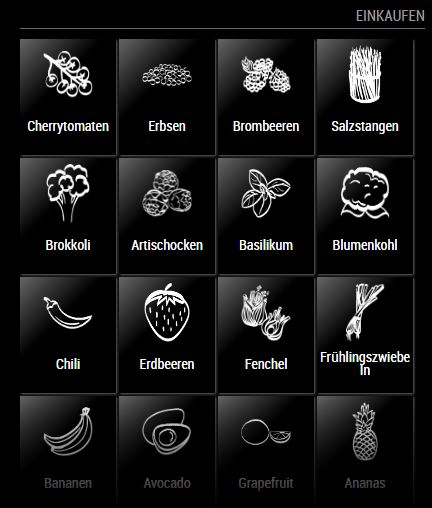

# MMM-bringList

This is a module for the [MagicMirror²](https://github.com/MichMich/MagicMirror/).

*The module is currently only available in german*

*The module is not released by the bring! company*

Displays Your Bring! List in a table view on your mirror. The refresh interval is 60 Seconds. You need to create a email/password account on the website to use this module. Just use the "create magic link" function in the app, use it to login to the website on a laptop or desktop comupter and create a emailadress/passowrd login.

The module was created using the REST api they use on their web site by reverse engineering it. It is absolutely unsupported by the bring team. If they change their API it will probably break the module. So use it at your own Risk.

## Install guide

login to your rapberry pi, cd into the modules folder and execute
```
git clone https://github.com/rseidt/MMM-bringList
cd MMM-bringList
npm install
```

## Using the module

To use this module, add the following configuration block to the modules array in the `config/config.js` file:
```js
var config = {
    modules: [
        {
            module: 'MMM-bringList',
            position: 'top_right',
            config: {
                // See below for configurable options
            }
        }
    ]
}
```

## Configuration options

| Option           | Description
|----------------- |-----------
| `listname`       | *Required* The name of the List you want to display. Please make sure this matches EXACTLY. The Name is case sensitive. 
| `email`          | *Required* The email adress to log in to your bring account 
| `password`       | *Required* The password to log in to your bring account 
| `columns`        | *Optional* The number of colums in the table view (default = 4)
| `maxrows`        | *Optional* The maximum number of rows to display in the table view  (default = 4)

### Example configuration:
```js
var config = {
    modules: [
        {
            module: 'MMM-bringList',
            position: 'top_right',
            config: {
                listname: 'Zuhause',
                email: 'someone@example.com',
                password: 'secret',
                columns: 3,
                maxrows: 5
            }
        }
    ]
}
```

## Example Screen:
